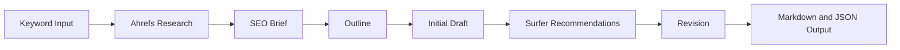

# Trusted Tech Hub Backend

Node.js + Express API with MongoDB (Mongoose) and CORS configured for the Vite frontend.

## Prerequisites
- Node.js 18+ recommended
- npm (comes with Node)
- MongoDB running locally or a connection string

## Setup
```bash
cd /Users/joecindergrid/Desktop/crm/beCRM
npm install
```

## Environment
Create a `.env` file based on the example:
```bash
cp /Users/joecindergrid/Desktop/crm/beCRM/.env.example /Users/joecindergrid/Desktop/crm/beCRM/.env
```

Update values in `.env` as needed:
- `PORT` (default `3000`)
- `MONGODB_URI`
- `OPENAI_API_KEY` for OpenClaw chat in Market Researcher
- `OPENAI_MODEL` optional override for the chat model (default `gpt-4.1-mini`)
- `HERMES_API_URL` for the Trusted Tech Assistant Hermes gateway (for example `https://hermes.example.com`)
- `HERMES_API_KEY` bearer token for server-to-server Hermes access
- `HERMES_MODEL` optional Hermes model name (default `hermes-agent`)
- `HERMES_REQUEST_TIMEOUT_MS` optional gateway timeout (default `120000`)
- `HUBSPOT_DEALS_PROXY_URL` preferred production URL for the secured `/hubspot-deals`
  gateway on the Hermes Droplet
- `HUBSPOT_DEALS_PROXY_TOKEN` encrypted shared bearer token for that gateway
- `HUBSPOT_MCP_URL` HubSpot MCP Streamable HTTP endpoint used by the deal assistant
- `HUBSPOT_MCP_ACCESS_TOKEN` encrypted bearer token for the MCP endpoint
- `HUBSPOT_MCP_REFRESH_TOKEN`, `HUBSPOT_MCP_CLIENT_ID`, `HUBSPOT_MCP_CLIENT_SECRET`, and
  `HUBSPOT_MCP_TOKEN_URL` recommended encrypted OAuth settings for automatic token renewal

In production, the HubSpot deal assistant should call the secured gateway on the
Hermes Droplet so MCP OAuth credentials remain on that host. Direct MCP variables
are retained as a fallback for installations without a Hermes Droplet. Configure
these values on the backend web-service component, not the frontend static site.
On the Hermes Droplet, set `HUBSPOT_PROXY_HOST` to its private VPC address and
`HUBSPOT_PROXY_TOKEN` to the same secret used by the backend. The gateway remains
off the public interface.

## Run (dev)
```bash
npm run dev
```

API base will be `http://localhost:3000` by default.

## CORS
Allowed origins are configured in:
`/Users/joecindergrid/Desktop/crm/beCRM/src/config/corsOptions.js`

Default allowed FE origins:
- `http://localhost:5173`
- `http://127.0.0.1:5173`

## Core routes
- `GET /health` returns `{ status: "ok", time: "..." }`
- `GET /company-context` returns the current Trusted Tech profile document
- `PUT /company-context` updates the company profile
- `POST /agents/trusted-tech-assistant/chat` sends Trusted Tech Assistant chat to Hermes
- `POST /agents/market-researcher/chat` sends a Market Researcher chat turn to OpenAI using the backend API key
- `GET /competitors` lists tracked competitors
- `POST /competitors` creates a competitor entry
- `GET /research-runs` lists research runs
- `POST /research-runs` creates a new research run
- `GET /research-runs/:id` fetches one research run
- `PATCH /research-runs/:id` updates a research run

## SEO content pipeline

The backend includes a deterministic, one-article workflow exposed through the API
and CLI. It researches a
keyword, builds a validated brief and outline, drafts Markdown, applies one Surfer
optimization pass, and saves both JSON and Markdown. It does not publish or schedule
content.



Architecture:

- `src/seo/ahrefsAdapter.js` and `surferAdapter.js`: credential, manual-input,
  mock, timeout, and normalization boundaries
- `src/seo/llmClient.js`: OpenAI Responses API calls, structured output, usage
  logging, and one validation retry
- `src/seo/stages.js`: brief, outline, draft, and single revision prompts
- `src/seo/schemas.js`: bounded input and inter-stage validation
- `src/seo/workflow.js`: stage orchestration, UUIDs, logging, and in-process
  duplicate protection
- `src/seo/persistence.js`: JSON and Markdown artifact storage
- `src/routes/seoContent.js`: protected generate/read endpoints
- `scripts/runSeoContentCli.js`: local and server CLI

### Install and configure

```bash
cd /path/to/crm_neel_tt/beCRM
npm install
cp .env.example .env
```

Relevant environment variables:

| Variable | Purpose |
| --- | --- |
| `OPENAI_API_KEY` | Required for real brief, outline, draft, and revision calls |
| `OPENAI_MODEL` | Responses API model; defaults to `gpt-4.1-mini` |
| `AHREFS_API_KEY` | Required for real Ahrefs calls |
| `AHREFS_API_URL` | Ahrefs API base; endpoint access varies by plan |
| `SURFER_API_KEY` | Required for configured direct Surfer integration |
| `SURFER_API_URL` | Account-supported Surfer content-analysis endpoint |
| `SEO_USE_MOCK_AHREFS` | Use the local Ahrefs fixture |
| `SEO_USE_MOCK_SURFER` | Use the local Surfer fixture |
| `SEO_USE_MOCK_LLM` | Development/smoke-only deterministic model fixture |
| `SEO_OUTPUT_DIR` | Artifact directory; defaults to `./data/seo-content` |
| `SEO_MAX_MODEL_RETRIES` | Structured-output retries; defaults to `1` |
| `SEO_REQUEST_TIMEOUT_MS` | Provider request timeout; defaults to `30000` |

Real keys belong only in `.env` or the DigitalOcean environment configuration.
They are never returned or logged.

### Run locally with mocks

```bash
npm run seo:smoke
```

Or provide an input context file:

```bash
SEO_USE_MOCK_AHREFS=true SEO_USE_MOCK_SURFER=true \
npm run seo:generate -- \
  --keyword "police body camera grants" \
  --company-context ./examples/trusted-tech.json
```

The context file may contain any optional request fields. It may also include
`manual_keyword_research` and `manual_surfer_recommendations` objects, which take
precedence over API/mock modes.

### API usage

Both endpoints sit behind the backend's existing Auth0 middleware.

```bash
curl -X POST "$API_BASE/api/seo-content/generate" \
  -H "Authorization: Bearer $ACCESS_TOKEN" \
  -H "Content-Type: application/json" \
  -d '{
    "primary_keyword": "police body camera grants",
    "company_name": "Trusted Tech",
    "target_audience": ["police chiefs", "procurement officers"],
    "desired_word_count": 1800
  }'
```

The response contains `job_id`, normalized research, brief, outline, both article
versions, recommendations, metadata, and timestamps. Retrieve a completed artifact
with:

```bash
curl -H "Authorization: Bearer $ACCESS_TOKEN" \
  "$API_BASE/api/seo-content/jobs/JOB_UUID"
```

### Real integrations and limitations

Set all three provider credentials and disable mock flags. Ahrefs API fields and
endpoint availability depend on the subscription; unavailable normalized fields
remain `null` or empty. `AHREFS_API_URL` can point at the account-supported API
base if its route differs.

Surfer does not expose every Content Editor feature to every account. A direct
integration runs only when `SURFER_API_URL` and `SURFER_API_KEY` identify an
authorized endpoint accepting `{ keyword, content }`. Otherwise use
`manual_surfer_recommendations`; the adapter remains the single place to map a
future account-specific response. The implementation never scrapes authenticated
services.

Jobs run synchronously in one API process. Duplicate protection is process-local,
so a durable queue/lock is a future production improvement. Artifacts are files,
not MongoDB records, and failed jobs currently appear in structured logs rather
than as persisted partial job documents.

### Test, outputs, and logs

```bash
npm test
npm run seo:smoke
ls -la data/seo-content
```

Each successful job creates `<job-id>.json` and `<job-id>.md`. Stage transitions,
provider limitations, validation retries, and available token usage are emitted as
single-line JSON to stdout. Inspect them through the backend process manager or
DigitalOcean App Platform Runtime Logs.

### DigitalOcean deploy/restart

Deploy the updated backend using the deployment mechanism already connected to
this repository, set the variables above in the backend component's encrypted
environment settings, and trigger a redeploy/restart from the DigitalOcean
component. No backend App Platform spec, Dockerfile, systemd unit, or PM2 config is
stored in this repository, so there is no safe repository-specific restart command
to claim. After restart:

```bash
curl "$API_BASE/health"
```

Then run an authenticated mock or real request and inspect Runtime Logs for
`"event":"seo_stage"`.
